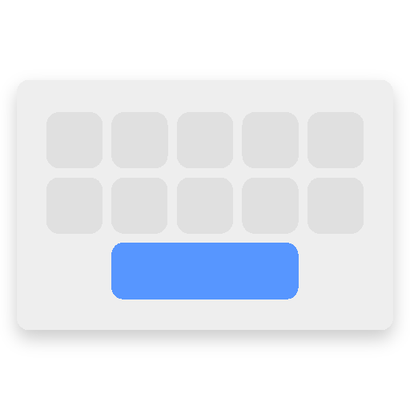
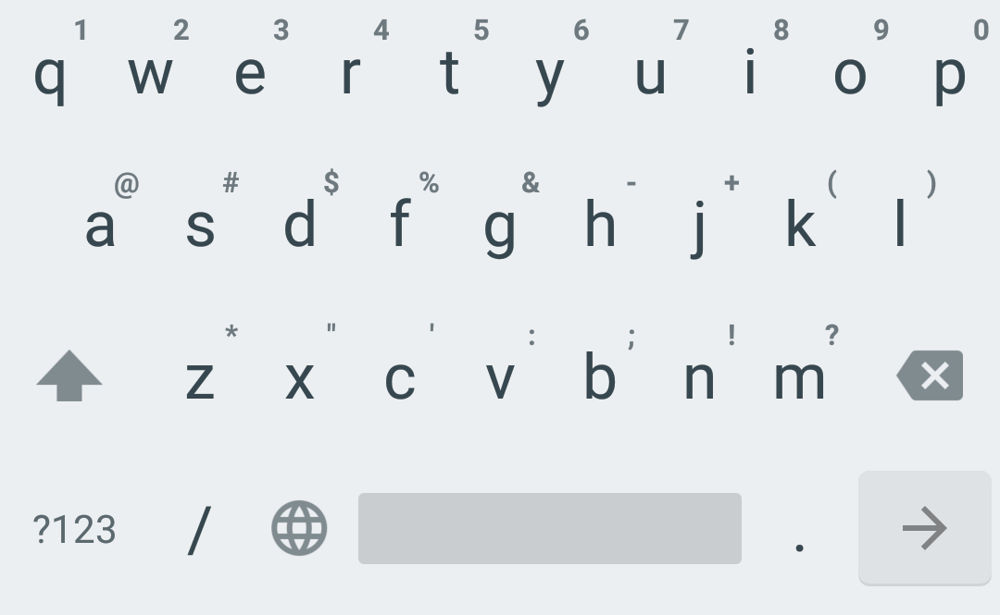

# Virtual IME

Minimalistic and lightweight keyboard (<1MB app size).

## Credits

Licensed under Apache License Version 2.

Fork of [Simple Keyboard](https://github.com/rkkr/simple-keyboard), based on AOSP [LatinIME](https://android.googlesource.com/platform/packages/inputmethods/LatinIME/) keyboard.
